<p align="center">
  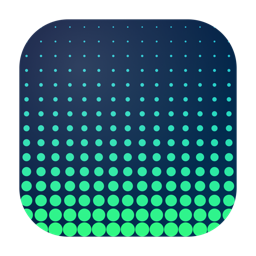
</p>

<h1 align="center">DotStudio</h1>

<p align="center">
  A native macOS app for building <b>dithered, halftone, matrix, and glitch screensavers</b> —
  and switching between them <b>without ever reopening System Settings</b>.
</p>

<p align="center">
  
  
  
</p>

<p align="center">
  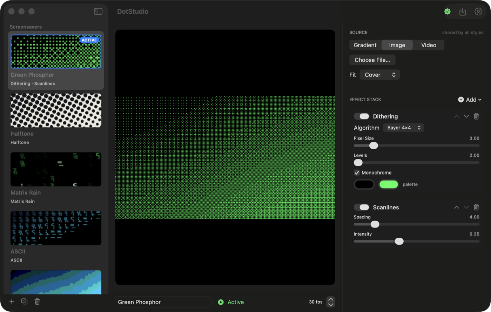
</p>

---

## Why

macOS makes you reinstall and re-pick a `.saver` every time you want a different screensaver.
DotStudio installs **one** universal screensaver, then lets you create, tune, and **switch
between styles entirely inside the app**. Pick a source once (a gradient, an image, or a video),
then flip through 36 GPU effects to see it dithered, halftoned, turned into Matrix rain, and more.

- **One install, infinite styles** — switch the active screensaver from the sidebar, no Settings trip
- **38 real-time Metal effects** — the full [grain.rad](https://grainrad.com) set, a complete dither
  suite ([ditherit.com](https://ditherit.com) style: ordered, blue noise, 12 error-diffusion kernels,
  Riemersma), a "cool pack" (kaleidoscope, bloom, VHS, thermal…), plus **NES 8-bit** and an
  **adjustable starfield**
- **Full-screen Preview** — one click to see the real screensaver, just like System Settings
- **Shared source** — one image / video / gradient feeds every style, with cover / fit / stretch
- **Live preview + per-effect controls** — reorder, toggle, and tune an effect stack
- **Lightweight** — GPU shaders, capped frame rate, low CPU
- **30+ demo screensavers** included

---

## Install

### Option A — download (recommended)
1. Grab **`DotStudio.dmg`** from the [latest release](https://github.com/dw2lam/dotstudio/releases/latest).
2. Open it and drag **DotStudio** into **Applications**.
3. Launch DotStudio → click **Install Screensaver** → **Open Wallpaper Settings**.
4. In **Wallpaper → Screen Saver**, pick **DotStudio** once.

That's the only time you touch System Settings — after that, switch screensavers from the app sidebar.

### Option B — build from source
```bash
brew install xcodegen
git clone https://github.com/dw2lam/dotstudio.git
cd dotstudio
xcodegen generate
xcodebuild -scheme DotStudio -configuration Release -derivedDataPath build build
cp -R build/Build/Products/Release/DotStudio.app /Applications/
```
> First Metal build may prompt for the Metal toolchain: `xcodebuild -downloadComponent MetalToolchain`.

---

## How to use

1. **Pick a source** (top-right): a gradient, or **import an image / video**. The source is *shared by all styles*.
2. **Choose a screensaver** in the sidebar — each shows a live thumbnail of how the source looks through it.
3. **Build your own** by stacking effects: hit **Add**, pick from the categorized menu, then tune the sliders,
   reorder with the chevrons, and recolor the palette. Effects apply top-to-bottom.
4. Click **Use as Screensaver** to make it the active one.
5. **Install** once; from then on, just pick a different style in the app and your Mac's screensaver follows.

`File → Add Demo Screensavers` drops the full demo pack into your library at any time.

---

## Effects gallery

> Rendered on the default navy→cyan gradient source. Import a photo and every effect re-renders on it.

| | | |
|:--:|:--:|:--:|
| 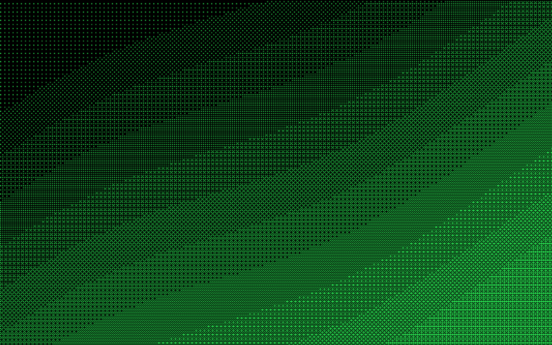<br>**Green Phosphor** | 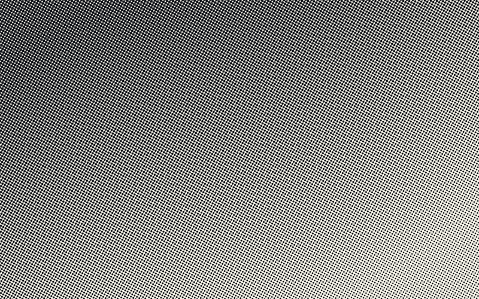<br>**Halftone** | 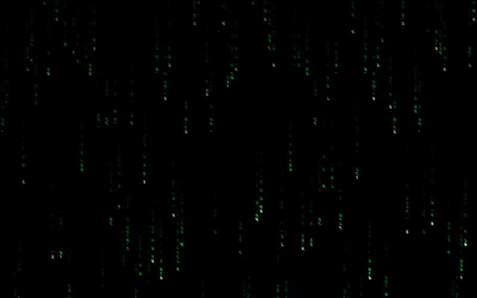<br>**Matrix Rain** |
| 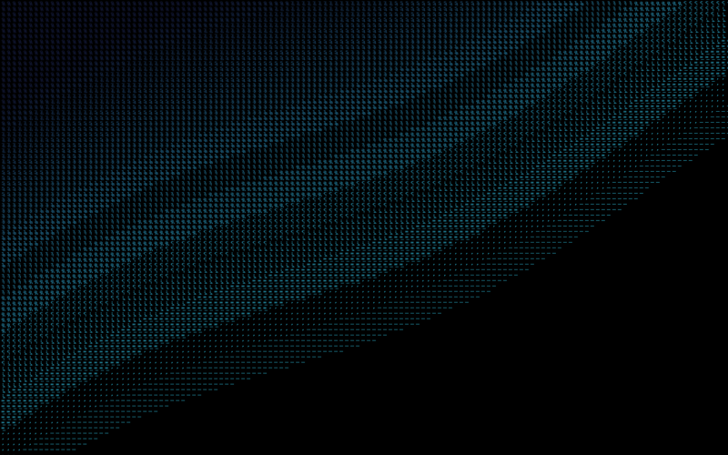<br>**ASCII** | 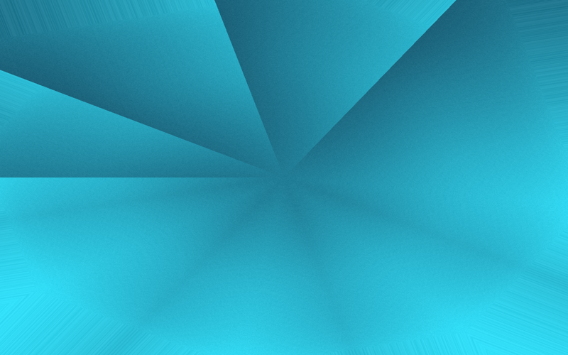<br>**Kaleidoscope** | 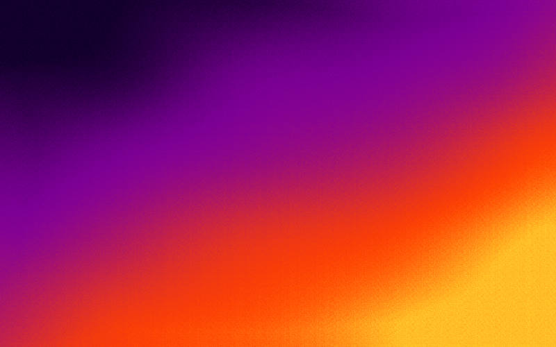<br>**Thermal** |
| 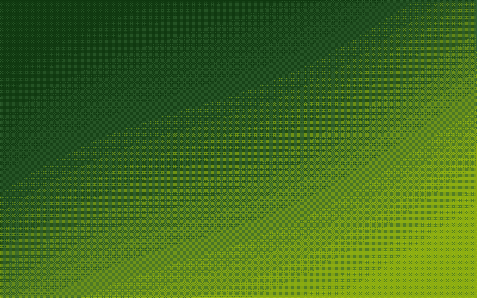<br>**Game Boy** | 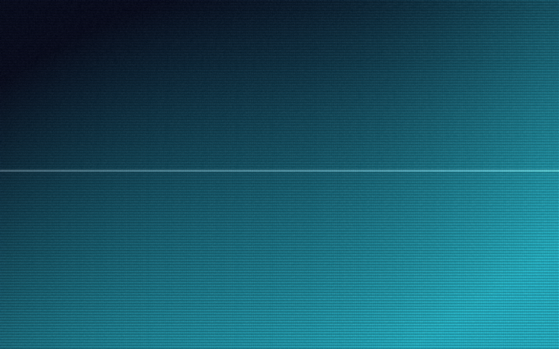<br>**VHS** | 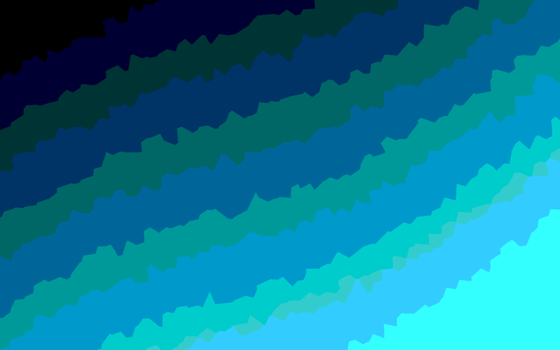<br>**Voronoi** |
| 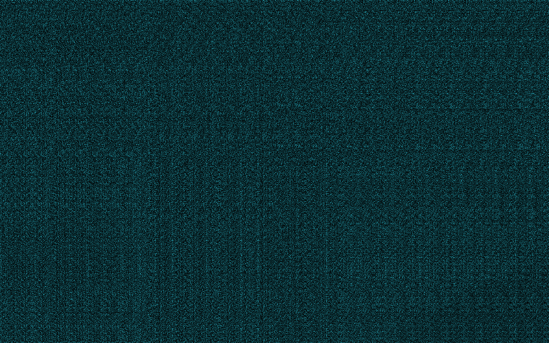<br>**Neon Edges** | 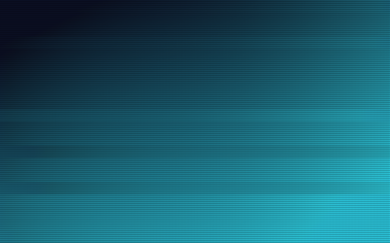<br>**Glitch Blocks** | 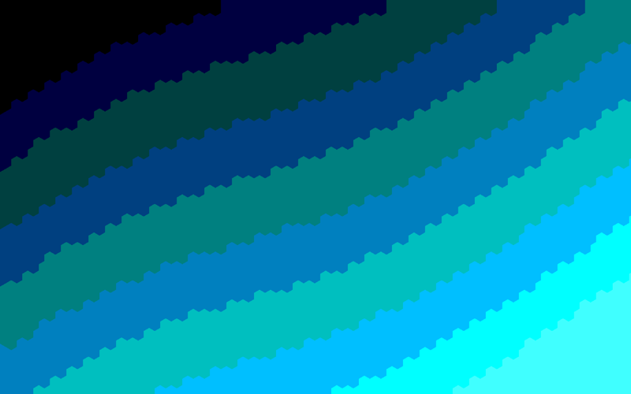<br>**Hex Mosaic** |

### Full effect list (38)

- **Dots & Dither** — Dithering (Bayer 2×2/4×4/8×8, Blue Noise, Floyd–Steinberg, Atkinson, Jarvis-Judice-Ninke, Stucki, Burkes, Sierra ×3, Fan, Shiau-Fan ×2, Simple 2D, **Riemersma**), Halftone, Dots, Pixelate, Blockify, Hex Mosaic, LED Panel, Truchet
- **Glyphs** — ASCII, Matrix Rain
- **Lines & Edges** — Edge Detection, Crosshatch, Contour, Wave Lines, Neon Edges
- **Glitch** — VHS, Scanlines, Grain, Chromatic Shift, Glitch Blocks, Pixel Sort
- **Color** — Threshold, Posterize, Phosphor, Vignette, Game Boy, **NES 8-Bit**, Bloom, Thermal, Toon
- **Warp & Mirror** — Kaleidoscope, Mirror, Fisheye, Swirl, Ripple
- **Generative** — Noise Field, Voronoi, **Starfield**, **Universe** (real-time day/night Earth, planets & stars)

> Error-diffusion and Riemersma dithers run on a GPU compute kernel; the rest are single-pass fragment shaders.

---

## How it works

DotStudio ships **one** screensaver bundle (`DotStudio.saver`). The app writes your preset library
into the screensaver host's sandbox container; the saver renders whichever preset is marked **active**
and live-reloads when you change it. So switching "screensavers" is just flipping the active preset —
no reinstalling, no System Settings. Everything renders through a single Metal über-shader
(one fullscreen pass per effect, ping-ponged), so it stays GPU-cheap.

---

## Notes

- Built and tested on **macOS 26 (Tahoe), Apple Silicon**. Requires macOS 14+.
- macOS's legacy screensaver host can be slow to load *any* third-party `.saver` on recent
  releases — judge by the real screensaver (let the screen idle), not the System Settings preview,
  and reboot if the host gets stuck.

## Credits

Inspired by [grain.rad](https://grainrad.com) and [ditherit.com](https://ditherit.com).
Built with SwiftUI + Metal.

Earth and planet maps in the **Universe** screensaver are from
[Solar System Scope](https://www.solarsystemscope.com/textures/) — licensed
[CC BY 4.0](https://creativecommons.org/licenses/by/4.0/).
